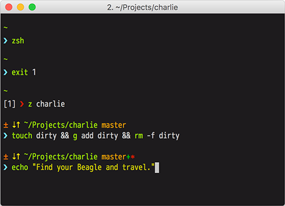

# Charlie

A zsh command prompt based on [Sindre Sorhus's Pure](https://github.com/sindresorhus/pure).

## Features

- Shows `git` branch and whether it's dirty (with a `*`) or wether it has
staged files (with a `+`).
- Indicates when you have unpushed/unpulled `git` commits with up/down arrows.
- If the command didn't exit with `0`:
    - The prompt character turns red
    - The exit code is displayed before the prompt character
- Username and host only displayed when in an SSH session.
- Shows the current path in the title and the current folder & command when a process is running.
- Makes an excellent starting point for your own custom prompt.
- Has slight SVN support.
- Includes [functios to show RVN and / or Python virtualenv info](https://github.com/c10b10/charlie/blob/master/charlie.zsh#L78-L93).

## Requirements

Requires git 2.3.0+ and ZSH 5.0.0+.

## Installation

I recommand integrating Charlie with either [oh-my-zsh](https://github.com/robbyrussell/oh-my-zsh) or with [prezto](https://github.com/sorin-ionescu/prezto).

If you want to install it manually, follow the [Pure](https://github.com/sindresorhus/pure) installation steps.

### [oh-my-zsh](https://github.com/robbyrussell/oh-my-zsh)

1. Symlink (or copy) `charlie.zsh` to `~/.oh-my-zsh/custom/charlie.zsh-theme`.
1. Symlink (or copy) `async.zsh` to `~/.oh-my-zsh/custom/async.zsh`.
1. Add `ZSH_THEME="pure"` to your `.zshrc` file.

### [prezto](https://github.com/sorin-ionescu/prezto)

1. Clone this repo in `~/.zprezto/modules/prompt/external/`.
1. Symlink `charlie.zsh` to
   `~/.zprezto/modules/prompt/functions/prompt_charlie_setup`.
1. Set `zstyle ':prezto:module:prompt' theme 'charlie'` in `~/.zpreztorc`.

## Options

### `CHARLIE_GIT_NEEDS_PULL_SYM`

(Default: ⇣): The symbol displayed when the Git remote has unpulled changes.

### `CHARLIE_GIT_NEEDS_PUSH_SYM`

(default: ↑): The symbol displayed in the preprompt when the Git has unpushed
commits.

### `CHARLIE_GIT_UNTRACKED_DIRTY`

(Default: 0): If set to a value different than 0, it will include untracked
files in the check that determines wether a Git repo is dirty.

### `CHARLIE_GIT_DIRTY_SYM`

(Default: ∗): The symbol displayed when the Git repo is dirty.

### `CHARLIE_GIT_AUTO_FETCH`

(Default: 1): Set `CHARLIE_GIT_AUTO_FETCH=0` to prevent Charlie from checking
whether the current Git remote has been updated.

## License

MIT © Alex Ciobica
